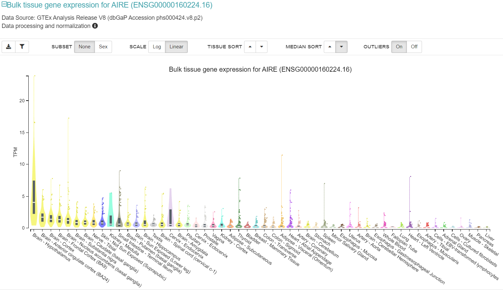
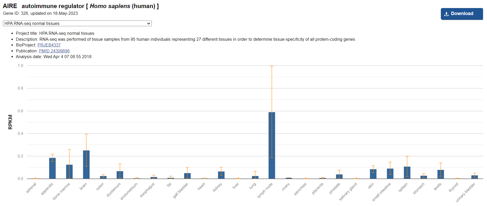
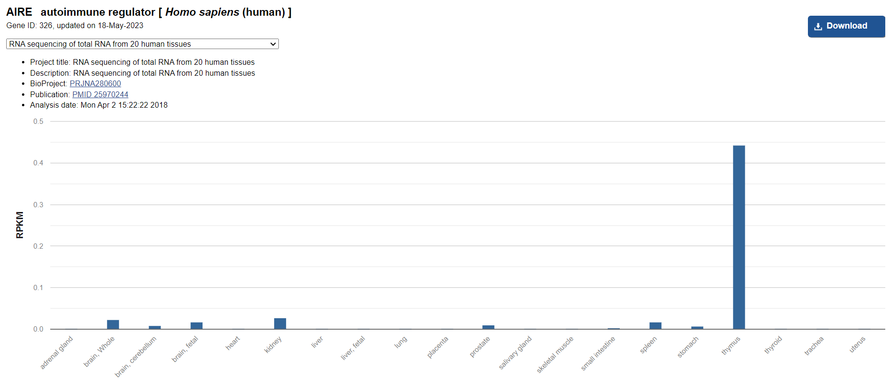
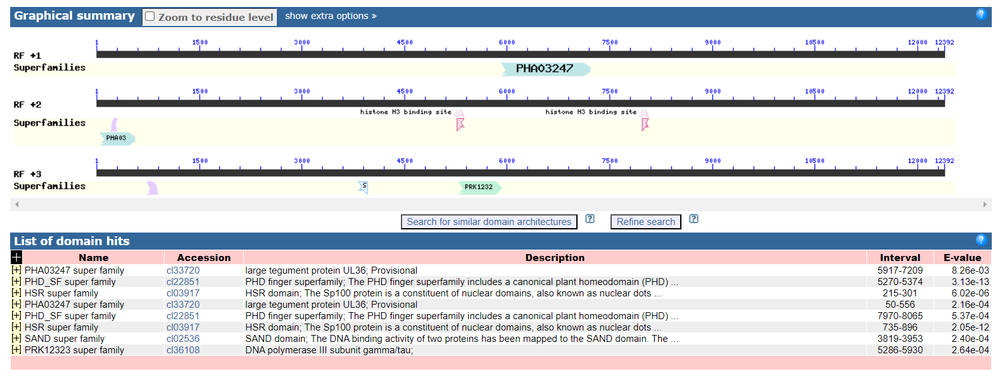

# hse23_project_AIRE
Целью работы над проектом является изучение методами сравнительной геномики ранней эволюции белка AIRE, взаимодействующего с эпигенетической модификацией H3K4me в клетках человека.

AIRE несёт функцию Histone modification read.

Согласно литературным данным "... AIRE избирательно взаимодействует с гистоном H3 через свой первый палец гомеодомена растений (PHD) (AIRE-PHD1) и преимущественно связывается с неметилированным H3K4 (H3K4me0)... AIRE-PHD1 является важным членом недавно идентифицированного класса PHD пальцы, которые специфически распознают H3K4me0…" [Org et al., 2008] "Некоторые посттрансляционные модификации хвостов H3, особенно диметилирование или триметилирование в H3K4, отменяли связывание Aire, в то время как другие допускались." [Koh et al., 2008].

Белок AIRE в комплексы не входит.

Белок AIRE экспрессируется в мозге по GTEx и лимфатическом узле и тимусе по NCBI.

В белке AIRE наблюдаются домены PHA03247 super family (2), PHD_SF super family (2), HSR super family (2), SAND super family, PRK12323 super family.

## Анализ гистонов
Для выравнивания белковых последовательностей гистонов использована программа MEGA, алгоритм MUSCLE с задаными по умолчанию параметрами.
Файлы выравниваний лежат в папке data.

#### H2A

Между белками наблюдается достаточно высокое сходство, чтобы предполагать происхождение от одной последовательности в результате копирования. Различия же объясняются делециями, приведшей к потери концевой части белка в ряде копий, и мутационным процессом, из-за которого последовательности постепенно расходились.

Для дальнейшей работы я выбрала последовательность NP 001387330.1 MACROH2A1 organism=Homo sapiens GeneID=9555 isoform=3, так как она одна их наиболее длинных.

#### H2B

Между белками наблюдается достаточно высокое сходство, чтобы предполагать происхождение от одной последовательности в результате копирования. Различия же объясняются делециями/инсерциями и мутационным процессом, из-за которого последовательности постепенно расходились.

Для дальнейшей работы я выбрала последовательность NP 001368918.1 H2BC4 organism=Homo sapiens GeneID=8347, так как она является одной из 6 последовательностей, обладающих наибольшим сходством.

#### H3

Между белками наблюдается высокая консервативность, что позволяет сделать вывод о происхождении от одного гена путем копирования, различие между генами очень мало и объясняется мутационным процессом.

Для дальнейшей работы я выбрала последовательность NP 003520.1 H3C1 organism=Homo sapiens GeneID=8350,  так как она является одной из 12 последовательностей, обладающих наибольшим сходством.

#### H4

Между белками наблюдается достаточно высокое сходство, чтобы предполагать происхождение от одной последовательности в результате копирования. Различия же объясняются мутационным процессом.

Для дальнейшей работы я выбрала последовательность NP 003529.1 H4C1 organism=Homo sapiens GeneID=8359,  так как она является одной из 12 последовательностей, обладающих наибольшим сходством.

## Литература
1. Koh, Andrew S., et al. "Aire employs a histone-binding module to mediate immunological tolerance, linking chromatin regulation with organ-specific autoimmunity." Proceedings of the National Academy of Sciences 105.41 (2008): 15878-15883.
2. Org, Tonis, et al. "The autoimmune regulator PHD finger binds to non‐methylated histone H3K4 to activate gene expression." EMBO reports 9.4 (2008): 370-376.
